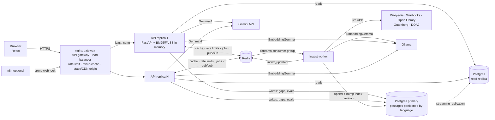

# GranthSetu

**An open-source digital library and AI study agent for Kannada, Hindi and English.** Students discover open knowledge and read the books their library may lend them; librarians register, review and publish resources under explicit rights and access policies; every reading, search and AI request respects those policies.

Built in one day at **Hacktoberfest Hack Day Bengaluru '26 × IEEE CIS (MSRIT)** by Team **DevDynasty**.
Challenges: **Best Use of Gemma 4** · **Best Open-Source AI Project**

> Kavya, a Class 10 student in Mysuru, types *"ದ್ಯುತಿಸಂಶ್ಲೇಷಣೆ ಎಂದರೇನು?"* (what is photosynthesis?).
> Library search in English finds nothing. GranthSetu understands her question, searches English, Hindi and Kannada sources,
> ranks them, explains the answer **in Kannada**, and shows only sentences it could match to an exact quote in an openly licensed source.

---

## Two halves of one product

1. **Public knowledge discovery**: cross-language search over open sources (Wikipedia, Wikibooks, Gutenberg, DOAJ, OpenAlex and more), grounded explanations with a citation verifier, Scan to Learn, the Knowledge Gap Board and lesson packs.
2. **Controlled digital library**: accounts and roles, a library-management portal, a submission → review → rights check → approval → processing → publication workflow, nine access policies with private or discoverable catalogues, entitlements for people, groups and institutions, a reader, and audit history.

Docs: [Setup and commands](docs/SETUP.md) · [Administrator guide](docs/ADMIN_GUIDE.md) · [Upload and approval](docs/UPLOAD_AND_APPROVAL.md) · [Rights and access policies](docs/RIGHTS_AND_ACCESS.md) · [Architecture](docs/ARCHITECTURE.md) · [Backup and recovery](docs/BACKUP_RECOVERY.md) · [Security review](docs/SECURITY_REVIEW.md) · [Testing](docs/TESTING.md) · [Evaluation](docs/EVALUATION.md) · [Limitations](docs/LIMITATIONS.md) · [Implementation report](docs/IMPLEMENTATION_REPORT.md)

## What it does

| | |
|---|---|
| **Ask any way** | Type, speak (browser speech recognition in kn-IN / hi-IN / en-IN), or **photograph a textbook page or notes**. |
| **Cross-language search** | Gemma expands the question into English, Hindi and Kannada search terms. A Kannada question can surface an English book. |
| **Hybrid retrieval** | BM25 keyword search + FAISS vector search (EmbeddingGemma), fused with Reciprocal Rank Fusion. |
| **Gemma reranking** | Each candidate gets a 0–10 relevance score and a one-line *"why this result"*. |
| **Grounded explanation + verifier** | Gemma writes 2–4 sentences, each with an exact quote from a passage. **Our code** keeps a sentence only if the quote really exists in that passage, the wording is supported, and no number is invented. Rejected sentences are shown struck out with the reason. |
| **Honest failure** | If nothing is good enough, it says so, does **not** generate an answer, logs the topic on the **Knowledge Gap Board**, and **fetches from open libraries live**. When new resources land, the search re-runs by itself. |
| **Live library** | A worker pulls from Wikipedia, Wikibooks, Open Library, Project Gutenberg and DOAJ through a job queue. Every API server reloads its index instantly through pub/sub. The licence is captured **per record from the source**. |
| **Lesson pack** | Pick results to get a printable page with verified key ideas, links with licences, and practice questions whose answers are verified against the sources. |
| **Digital library** | Librarians add books (PDF or UTF-8 text, or catalogue-only / external-provider records), verify rights, choose one of nine access policies, and publish. A worker extracts text (OCR for scanned pages with Tesseract when the licence allows machine processing), finds chapters, chunks, embeds and indexes it. Readers get chapters, page navigation, in-book search, bookmarks and progress. |
| **Access control everywhere** | One server-side authorization service decides discover / read / download / AI use for every request. Restricted full text never enters ranking, snippets, AI prompts, lesson packs or cached answers for someone who may not read it. Withdrawals, revocations and expiries apply on the next request. |
| **Evaluation** | One click runs an ablation on 30 labelled kn/hi/en queries: keyword vs meaning vs hybrid vs hybrid + Gemma rerank (hit@5, MRR, precision, cross-language hit, latency, verifier pass rate). |

## How Gemma 4 is used (and why it is essential)

| Job | Model | Without it |
|---|---|---|
| Read a photo of a Kannada/Hindi/English page or notes → structured JSON (topic, key terms, questions, query) | **Gemma 4** (vision) via the Gemini API | Scan to Learn does not work |
| Understand the query and expand it into three languages | **Gemma 4** via the Gemini API | Kannada/Hindi questions cannot reach English sources |
| Rerank candidates with a reason | **Gemma 4** via the Gemini API | Results are ordered by lexical/vector similarity only |
| Grounded explanation in the learner's language, sentence by sentence with quotes | **Gemma 4** via the Gemini API | Sources only, no explanation |
| Multilingual embeddings for semantic search | **EmbeddingGemma 308M** (open weights) via Ollama | Falls back to a clearly labelled lexical method |
| Offline mode | Any **Gemma** you have pulled in Ollama (`LLM_PROVIDER=ollama`) | Uses the API |

Model IDs are **not hardcoded**: if `GEMMA_MODEL` is empty, the app lists the models your key can see and picks the best Gemma 4 variant. Gemma is released under the [Gemma terms of use](https://ai.google.dev/gemma/terms) (check the licence page for the exact Gemma 4 version you use).

Deterministic code does everything that must be exact: indexing, BM25, RRF fusion, ID validation, licences, the citation verifier, thresholds and logging.

## Architecture



**Agent workflow** (every step appears in the UI's *Agent trace*):
`input → understand (Gemma) → expand kn/hi/en → BM25 + FAISS → RRF → Gemma rerank → confidence decision → grounded explanation (Gemma) → citation verifier (code) → answer`, **or** `→ Gap Board + live fetch job → auto re-search`.

System-design details (load balancing, caching, CDN, indexing, sharding, replication, message queue, microservices, gateway, rate limiting, CAP, scaling): **[docs/SYSTEM_DESIGN.md](docs/SYSTEM_DESIGN.md)**.

## Run it

### Option A: full distributed stack (Docker)
```bash
cp .env.example .env            # set POSTGRES_PASSWORD and REPLICATION_PASSWORD (required); add GEMINI_API_KEY
ollama pull embeddinggemma      # recommended: open-weight embeddings (or: make local-ai)
docker compose up --build -d    # migrate, gateway, 2 API replicas, worker, Postgres primary + replica, Redis
make admin EMAIL=you@college.edu   # create the first administrator (there is no default account)
open http://localhost:8080
```
On first start the worker fetches the 40 seed topics **live** (a few minutes; watch *Live library*). Scale out with `make scale N=4`.
Optional: `docker compose --profile automation up -d n8n`, then import `automation/n8n/granthsetu-live-library.json`.

### Option B: lite mode (no Docker, 2 terminals)
```bash
make install
cp .env.example .env            # add GEMINI_API_KEY
make dev                        # API :8000 (SQLite + in-process queue) and web :5173
cd backend && python -m granthsetu.manage create-admin --email you@college.edu
```
Lite mode is for development. PostgreSQL is the supported database for real use (Option A).

### Check Gemma before the demo
```bash
make smoke    # lists the Gemma models your key can see and runs understand + rerank once
```

### Venue wifi backup
After a successful live seed: `make snapshot` writes `data/snapshot.jsonl.gz` (real records with licences). Restore with
`cd backend && python -m granthsetu.snapshot import ../data/snapshot.jsonl.gz`.

## API

| Method | Path | Purpose |
|---|---|---|
| POST | `/api/search` | `{query, mode: agent\|hybrid\|keyword\|semantic}` → results, explanation, trace |
| POST | `/api/scan` | multipart image → structured page reading (never stored) |
| POST | `/api/lesson-pack` | `{query, resource_ids, lang}` → verified practice questions |
| GET | `/api/resources`, `/api/gaps`, `/api/eval/latest`, `/api/system` | library, gap board, last evaluation, live architecture status |
| POST | `/api/ingest/topic`, `/api/eval/run` | queue live ingestion / evaluation (rate limited) |
| GET | `/api/events` | Server-Sent Events: jobs and index updates |
| POST | `/api/auth/register`, `/api/auth/login`, `/api/auth/logout`, `/api/auth/token`; GET `/api/auth/me` | accounts (HttpOnly cookie for browsers, bearer token for scripts) |
| GET | `/api/catalogue`, `/api/books/{id}`, `/api/books/{id}/pages/{n}`, `/api/books/{id}/search`, `/api/books/{id}/download` | digital library and reader (policy-checked per request) |
| GET/PUT/POST/DELETE | `/api/me/library`, `/api/me/progress/{id}`, `/api/me/bookmarks`, `/api/me/data` | personal reading data |
| * | `/api/manage/...` | resources, files, workflow transitions, rights, entitlements, jobs, audit (permission-checked) |
| * | `/api/admin/users`, `/api/admin/orgs`, `/api/admin/institutions`, `/api/admin/groups` | roles, institutions, groups, memberships |
| POST | `/api/admin/refresh`, `/api/admin/ingest`, `/api/admin/reembed` | harvesting: administrator session or the scoped `AUTOMATION_TOKEN` (n8n) |

## Authorised and paid resources (second column)

Much useful material sits behind a login or a price. GranthSetu lists it **next to** the free results, in a separate column, and sends the reader to the publisher:

| Kind | Source | How the reader gets it |
|---|---|---|
| Subscription papers | OpenAlex (non-open-access works) | Open the publisher link; sign in with the college/institution login. Optional: paste your library's EZproxy / OpenAthens prefix and links open through it |
| Borrowable books | Open Library / Internet Archive lending | Free Internet Archive account, borrow online |
| Paid books | Google Books (for-sale volumes, price shown in INR) | Buy at the seller's page |

Rules we follow: only metadata and the abstract or description the source itself publishes are stored; **no full text, no scraping behind logins, no credentials ever pass through GranthSetu**; restricted items are never used to write explanations or lesson packs; every card says what kind of access it needs.

## Agent skill

`skills/granthsetu-search/` follows the [Agent Skills](https://agentskills.io) open standard (`SKILL.md` + script), so any compatible agent can use GranthSetu as a tool: `python skills/granthsetu-search/scripts/search.py "जल चक्र को समझाइए"`.

## Data and licences

| Source | What we take | Licence handling |
|---|---|---|
| Wikipedia (en, hi, kn) | Article text via the MediaWiki API; hi/kn pages linked to the English topic through langlinks | Licence read from each wiki's `rightsinfo` |
| Wikibooks | Open textbook chapters | Same, per wiki |
| Open Library | Catalogue records of books with `ebook_access=public` | Metadata CC0; book rights must be checked per item (shown as such) |
| Project Gutenberg (Gutendex) | Books with `copyright=false` | Public domain in the USA, shown per record |
| DOAJ | Open-access article abstracts with full-text links | Journal licence looked up per ISSN; "not stated" if missing |
| OpenAlex | Open-access papers (abstract + link), ~250M works indexed | Licence from the record's best open location; "not stated" if missing; non-en/hi/kn skipped |
| arXiv | Preprint abstracts | Abstract metadata CC0; paper licence linked on its arXiv page |
| Europe PMC | Open-access biomedical papers | Licence field from the record |
| Internet Archive | Texts that carry a licence URL | Only items with a licence are kept |
| Wikisource (en, hi, kn) | Public-domain and freely licensed source texts | Wiki rights info |

Pirate sites (Sci-Hub, LibGen, Z-Library) are deliberately **not** used. Paywalled material appears only as a link to the legitimate publisher, in the separate second column.

No resource is hand-written. Unit-test fixtures live in `backend/tests/fixtures/`, are labelled *TEST FIXTURE*, and are never loaded into the library.

## Privacy and safety
- Accounts are optional for discovery. Passwords are hashed with scrypt; sessions are server-side and revocable. Reading progress and bookmarks can be deleted by the user; search queries are not stored with accounts.
- Scan to Learn photos are re-encoded in memory (EXIF/GPS stripped), sent to the configured Gemma model, and never written to disk, the cache or logs.
- In API mode, queries and photos go to Google's Gemini API, and the UI says so. Offline mode (local Gemma in Ollama) keeps them on the server.
- The Gap Board stores only language, subject and a topic label, never the raw query or any identifier.
- Explanations are shown only when verified; weak results are hidden behind an explicit "show anyway".

## Status (honest)

| Area | Status |
|---|---|
| Agent workflow, hybrid retrieval, RRF, Gemma rerank, grounded explanation, citation verifier, honest failure, Gap Board + live fetch | ✅ implemented and unit tested (Gemma replaced by a scripted test double in tests) |
| Distributed mode: 2 API replicas, worker, Postgres primary + streaming replica, partitions, Redis cache/queue/pub-sub, shared rate limits, SSE | ✅ run and checked natively (Postgres 16 + Redis 7 processes) |
| Live ingestion from the five sources | ✅ implemented; adapters unit-tested on recorded API shapes. **Run it once with internet before the demo.** |
| Scan to Learn | ✅ implemented (validation, privacy, editable output); needs a Gemma vision model on your key |
| Voice | ⚠️ browser Web Speech API (Chrome/Edge). IndicConformer not integrated yet |
| Translation | ⚠️ done by Gemma inside the explanation step. IndicTrans2 not integrated yet |
| Offline mode | ⚠️ works when a Gemma model is pulled in Ollama; not benchmarked |
| OpenStax, NCERT, NPTEL, DIKSHA | ❌ no public search API; add as curated entries (see CONTRIBUTING) |
| Lesson pack | ✅ printable page (browser "Save as PDF", so Kannada/Hindi text renders correctly); only from resources the user may read and the licence lets us process |
| Accounts, roles, management portal, workflow, nine policies, entitlements, reader, uploads, OCR, outbox, audit | ✅ implemented; 58 automated tests pass on SQLite and on PostgreSQL 16; acceptance workflows A–G run over HTTP against API + worker + PostgreSQL + Redis, including a restart (see [docs/TESTING.md](docs/TESTING.md)) |
| Docker images and `docker compose up` | ⚠️ compose file validated; images **not built or run** in our environment (no Docker daemon). Native processes were used instead |
| Malware scanning of uploads | ❌ no scanner integrated; files are recorded as `not_configured` (see [docs/SECURITY_REVIEW.md](docs/SECURITY_REVIEW.md)) |

## Evaluation
See **[docs/EVALUATION.md](docs/EVALUATION.md)**. Run it from the *Evaluation* page after the library is seeded; numbers are computed live and stored with the configuration they came from.

## Team
| Name | Role |
|---|---|
| Chaithra P | Lead |
| Bikash Kumar Sah | AI/ML and multilingual pipeline |
| Veerla Jishnu Teja | Frontend, integration and demo |
| Abhinand J Prakash | Backend and semantic search |

## Contributing
Issues labelled `knowledge-gap` and `good first issue` are open. See [CONTRIBUTING.md](CONTRIBUTING.md).

## Licence
Code: MIT ([LICENSE](LICENSE)). Content keeps its source licence, shown on every result. Models: Gemma and EmbeddingGemma under Google's Gemma terms.
