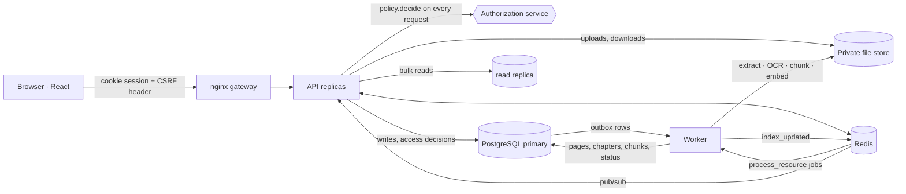

# Architecture

GranthSetu is one FastAPI application (stateless, run as N replicas), one worker process, PostgreSQL (authoritative), Redis (queue, cache, pub/sub, rate limits), a private file store, and a React single-page app served by an nginx gateway. Distributed-systems notes (load balancing, replication, partitions, CAP) are in [SYSTEM_DESIGN.md](SYSTEM_DESIGN.md).

## Backend modules

| Module | Responsibility |
|---|---|
| `migrations.py` | versioned, forward-only schema migrations, advisory-locked on PostgreSQL |
| `db.py` | connection pools, read/write split, atomic multi-statement transactions with optimistic "require a row" checks |
| `auth.py` | scrypt password hashes, server-side sessions (hashed tokens), cookie + bearer auth, CSRF guard, permission dependencies |
| `policy.py` | **the** authorization service: principals, role permissions, the nine policies, catalogue setting, entitlements, `decide()`, the matching SQL predicate for listings |
| `library.py` | metadata validation, the submission state machine, rights verification, uploads, entitlements, processing jobs, outbox delivery, crash recovery |
| `storage.py` | private file store with random keys, no overwrite, no path traversal |
| `extract.py` | content sniffing, PDF/text extraction in an isolated process with a time limit, OCR, chapter detection |
| `retrieval.py` | BM25 + FAISS hybrid index with an access mask applied **before** ranking (FAISS `IDSelectorBatch`) |
| `agent.py` | the search/explain workflow; re-checks each candidate against the database; only readable, AI-permitted passages go to the model |
| `ai_tasks.py`, `verifier.py` | Gemma prompts (documents marked as untrusted), deterministic citation verification |
| `api.py`, `api_platform.py` | HTTP routes |
| `ingest.py` | worker loop: processing jobs, outbox delivery, stale-job sweeper, open-source harvesting |
| `manage.py` | operator commands |

## Data model (PostgreSQL)

| Area | Tables |
|---|---|
| Identity | `users`, `roles`, `user_roles`, `sessions`, `institutions`, `institution_memberships`, `user_groups`, `group_memberships` |
| Library | `resources` (the books table; also holds harvested records), `book_files`, `book_pages`, `book_chapters`, `passages` (chunks; partitioned by language) |
| Rights and access | columns on `resources` (`rights_basis`, `rights_status`, `allow_display`, `allow_download`, `allow_ai`, `policy`, `catalogue`, `institution_id`, `group_id`), `entitlements` (user, group or institution; expiry; revocation) |
| Workflow | `resources.status`, `publication_events`, `book_reviews` |
| Processing | `processing_jobs` (at most one active job per resource, enforced by a partial unique index), `processing_errors`, `outbox`, `meta.index_version` |
| User data | `reading_progress`, `bookmarks` (with notes) |
| Operations | `audit_logs`, `meta` (settings, `policy_version`), `eval_runs`, `gaps` |

Authors, categories and languages are columns rather than separate tables; reading lists are not implemented (see [LIMITATIONS.md](LIMITATIONS.md)).

## Key flows

**Publish.** `transition(publish)` runs one transaction: status `APPROVED → PROCESSING`, a publication event, a queued `processing_jobs` row, an `outbox` row and an audit row. The worker delivers the outbox row to the Redis stream, claims the job atomically (`UPDATE … WHERE status='queued' RETURNING`), verifies the file checksum, extracts, chunks and embeds, then in **one** transaction replaces the resource's pages/chapters/chunks, marks the job succeeded, sets `PUBLISHED`, bumps `policy_version` and queues an index refresh. A duplicate delivery finds nothing to claim. A crash leaves the job `running`; the sweeper re-queues it.

**Search.** The index holds only `PUBLISHED` resources. Per request, `access_mask()` decides from the principal which passages may be scored: full-text chunks need `read`, metadata chunks need `discover`. BM25 scores are zeroed outside the mask and FAISS searches only allowed ids. The agent then re-checks each candidate against the current database row, so a withdrawal or revocation that happened after the index snapshot is still honoured. Cache keys include the principal and `policy_version`.

**Read.** Every reader endpoint calls `decide()`; responses carry `Cache-Control: private, no-store`. Files are streamed by the API after the check; there are no public or long-lived file URLs, so a withdrawn book cannot be fetched through an old link.

## Models

| Interface | Integrated | Notes |
|---|---|---|
| Gemma 4 (Gemini API or Ollama) | yes, behind `llm.py` with timeouts, retries and an availability re-check | query understanding, rerank, grounded explanation and translation, practice questions, page reading |
| EmbeddingGemma | yes (Ollama or sentence-transformers) | falls back to a labelled lexical hash embedder that is **not** semantic |
| Tesseract OCR | yes, when installed | Docker image installs English, Kannada and Hindi |
| IndicConformer (speech) | **no** | voice uses the browser's Web Speech API; the transcript lands in the search box for the user to confirm or edit |
| IndicTrans2 (translation) | **no** | translation is done by Gemma inside the explanation step; untranslated sentences are labelled as such |
